<p align="center">
  <a href="https://www.npmjs.com/package/dexe-mcp">
    
  </a>
</p>

<p align="center">
  <a href="https://www.npmjs.com/package/dexe-mcp"></a>
  <a href="https://nodejs.org"></a>
  <a href="https://github.com/edward-arinin-web-dev/dexe-mcp/blob/main/LICENSE"></a>
  <a href="https://modelcontextprotocol.io"></a>
  <a href="https://github.com/edward-arinin-web-dev/dexe-mcp"></a>
  <a href="https://github.com/edward-arinin-web-dev/dexe-mcp"></a>
</p>

<h2 align="center">Governance, as a function call.</h2>

<p align="center">
  <code>dexe-mcp</code> turns the entire DeXe Protocol — every DAO, every proposal type, every read, every write — into <b>one Model Context Protocol server</b>.<br/>
  Plug it into Claude, Cursor, ChatGPT, or any tool-using LLM and watch your agent <b>deploy DAOs, draft proposals, vote, delegate, execute, claim</b> — straight from natural language.<br/>
  <sub>Calldata-first by default: keys stay in your wallet. Broadcast mode? One env var.</sub>
</p>

<p align="center">
  <a href="#install-in-claude-code-no-terminal"><b>Install</b></a> &nbsp;·&nbsp;
  <a href="#quickstart">Quickstart</a> &nbsp;·&nbsp;
  <a href="#what-you-can-build">What you can build</a> &nbsp;·&nbsp;
  <a href="#built-for-whats-next">Built for what's next</a> &nbsp;·&nbsp;
  <a href="#tool-catalog">Tool catalog</a> &nbsp;·&nbsp;
  <a href="#swarm-test-harness">Swarm tests</a> &nbsp;·&nbsp;
  <a href="https://github.com/edward-arinin-web-dev/dexe-mcp/tree/main/docs">Docs</a>
</p>

---

## Install in Claude Code (no terminal)

Two lines, typed inside Claude Code. No npm, no JSON to edit, no keys:

```
/plugin marketplace add edward-arinin-web-dev/dexe-mcp
/plugin install dexe@dexe-mcp
```

Then just ask:

> *"Show the treasury of `0x…` on BSC."*

Reads work with **zero setup** — the server falls back to public BSC RPC out of the box, and the governance skills (create DAO, create proposal, vote & execute, OTC) install with the plugin.

**Want to create DAOs or proposals, or broadcast transactions?** Type **`/dexe-setup`** and Claude walks you through adding your keys (a Pinata token for IPFS, a wallet for signing) — one guided step, nothing to hand-edit.

> Using **Cursor, ChatGPT, or another MCP client**, or prefer the terminal? → [**docs/INSTALL.md**](./docs/INSTALL.md)

---

## The shift

For a decade, DAOs lived behind dashboards. Every action was a click. Every read was a tab. Every coordination loop needed a human at the keyboard.

That era is ending.

LLMs can now reason about voting power, weigh proposals against a mandate, draft calldata, simulate execution, and ask your wallet to sign — **continuously, across every DAO you care about, all at once.** What was a UI is becoming a conversation. What was a treasurer's spreadsheet is becoming an always-on agent.

**`dexe-mcp` is the substrate that makes it real for the DeXe stack — and now for external OpenZeppelin Governor DAOs as well.** One MCP server. 156 typed tools across 19 groups. Every flow the DeXe frontend exposes — plus a generic `dexe_gov_*` surface targeting Uniswap, Compound, and Optimism.

|     | What you get |
|-----|------|
| **Total protocol coverage** | All **33 proposal types**. Validator chamber. Expert delegation. OTC multi-tier sales with merkle whitelists. Internal config. Off-chain backend. Nothing hand-rolled. Nothing missing. |
| **Key-safe by default** | Every write returns `TxPayload = { to, data, value, chainId }`. Your wallet — MetaMask, Safe, Ledger, anything — signs. **No keys touch the MCP unless you explicitly set `DEXE_PRIVATE_KEY`.** |
| **Battle-tested on-chain** | **57 swarm-test scenarios** running on BSC testnet against real fixture DAOs. Every builder validated end-to-end — draft → IPFS → propose → vote → execute. Latest pass: 2026-05-12. |
| **AI-native, model-agnostic** | Tool names, argument schemas, and return shapes are tuned for LLM chaining. Works with Claude, GPT, Gemini, Mistral, Llama — anything that can call MCP tools. |
| **Open source, no middleman** | MIT. Your RPC. Your wallet. Your keys. Your rules. No telemetry. No SaaS gatekeeper. No rate limits. Run it on your laptop or behind your agent fleet. |

---

## What you can build

> **One MCP server. Dozens of products that didn't exist a year ago.**

- **Governance copilots in chat** — *"Show every proposal I haven't voted on across all my DAOs, ranked by deadline."* The agent fans out `dexe_user_inbox`, ranks results, drafts your votes. You hit sign.
- **Intent-driven proposal drafting** — *"Stream 50,000 USDT from treasury to the dev fund, vesting linearly over six months."* The agent picks the right builder (`_token_distribution`), assembles nested calldata, pins metadata to IPFS, returns one signable payload. What used to be a 14-field form is now a sentence.
- **AI delegates that reason** — agents that read every proposal, weigh it against a written mandate, vote, and publish their reasoning on-chain. Real accountability for delegated power.
- **24/7 autonomous treasury bots** — policy expressed as code, executed as proposals. Market triggers, runway thresholds, vesting schedules — all enforced without a human in the loop, every action a signed on-chain decision.
- **Multi-DAO coalition orchestration** — one agent coordinating votes across allied protocols, tracking quorums, building coalitions, executing in lockstep.
- **Conversational DAO frontends** — apps where there *is* no UI. The MCP server is the backend. The chat is the dashboard. The wallet is the only button.
- **Adversarial governance simulators** — spin up swarms of AI proposers, voters, and validators to red-team a parameter change *before* it hits mainnet. The swarm harness ships with this already (see [Swarm tests](#swarm-test-harness)).
- **OTC sale autopilots** — open multi-tier sales with merkle whitelists, manage buyer flows, fulfill vested payouts — all without a sale-management UI.
- **Forensics and compliance** — `dexe_decode_proposal` + `_decode_calldata` make any historic on-chain proposal human-readable. Agents narrate every governance decision for audits, postmortems, and research.

If you can describe a DeXe governance operation in a sentence, `dexe-mcp` has the tool.

---

## Built for what's next

The next generation of DAOs will be **operated by language, not by clicks.**

- **AI delegates will outvote human ones.** They read every proposal. They show their reasoning. They never miss a deadline.
- **Treasuries will defend themselves.** Policy bots react to market moves, rebalance, claim, redelegate — all through governance, never around it.
- **Cross-DAO coordination will be ambient.** Coalitions form in seconds via agent-to-agent negotiation, ratified by on-chain votes.
- **Governance frontends will collapse into chat.** The dashboard moves into the conversation. The UI is the prompt.
- **Every proposal will be simulated first.** Adversarial AI swarms stress-test changes before they reach mainnet.
- **Audit will run continuously.** Compliance agents decode and narrate every historical decision in real time.

`dexe-mcp` is the connective tissue. Bring your model. Bring your wallet. Bring your DAO.

---

## Quickstart

> **In Claude Code?** Skip this — use the [two-line plugin install](#install-in-claude-code-no-terminal) above. The steps below are for **other MCP clients** (Cursor, ChatGPT, custom agents) and terminal/manual setups. Reads need no env at all; env is only for IPFS uploads and broadcasting.

**Fastest path — wizard + diagnostic:**

```bash
npm install -g dexe-mcp
npx dexe-mcp init      # interactive setup (network, Pinata, signer mode)
npx dexe-mcp doctor    # verify (RPC + Pinata + IPFS gateway + subgraph)
```

The wizard writes `.env` at the repo root and prints a `~/.claude.json`
snippet to paste. Then `doctor` walks every recognized `DEXE_*` var and
returns a pass/warn/fail report with paste-ready remediation hints. See
[`docs/SETUP.md`](./docs/SETUP.md) for the full runbook,
[`docs/DOCTOR.md`](./docs/DOCTOR.md) for the check reference, and
[`docs/MIGRATION.md`](./docs/MIGRATION.md) if you are upgrading from
0.7.x.

**Manual path:**

**1.** Install:

```bash
npm install -g dexe-mcp
```

**2.** Register with your MCP client (`.mcp.json`, `claude_desktop_config.json`, Cursor settings, etc.):

```json
{
  "mcpServers": {
    "dexe": {
      "command": "dexe-mcp",
      "env": {
        "DEXE_RPC_URL": "https://bsc-dataseed.binance.org",
        "DEXE_CHAIN_ID": "56"
      }
    }
  }
}
```

> **Windows note:** if your MCP client can't resolve the `dexe-mcp` shim on PATH, point it at the installed script directly:
> ```json
> { "command": "node", "args": ["<npm root -g>/dexe-mcp/dist/index.js"] }
> ```
> (Run `npm root -g` to get the absolute path.)

**3.** Ask your agent something governance-shaped:

```jsonc
// Discover every proposal type your DAO can run
dexe_proposal_catalog({ category: "all", implementedOnly: true })

// Snapshot a DAO — treasury, voters, settings, validators, everything
dexe_dao_info({ govPool: "0x..." })

// Draft a token-transfer proposal (returns ready-to-sign calldata)
dexe_proposal_build_token_transfer({
  govPool:   "0x...",
  token:     "0x...",
  recipient: "0x...",
  amount:    "1000000000000000000"
})
```

The agent gets back a `TxPayload`. Pass it to your wallet. Sign. Submit. Done.

**Want the MCP to broadcast too?** Set `DEXE_PRIVATE_KEY` and unlock the composite signing flow (`dexe_proposal_create`, `dexe_proposal_vote_and_execute`, `dexe_tx_send`, `dexe_tx_status`). Strictly opt-in — default stays calldata-only.

---

## Prerequisites

- **Node.js ≥ 20** with a working `npm` (`node --version` and `npm --version` must both succeed).
- **Git** — needed the first time a build tool (`dexe_compile` / `dexe_test` / `dexe_lint`) runs, to shallow-clone DeXe-Protocol. Skippable if you set `DEXE_PROTOCOL_PATH` to an existing checkout.

## First run

The MCP server starts instantly. On the first build-tool call, dexe-mcp shallow-clones DeXe-Protocol into a platform cache directory and runs `npm install` there once. Most tools never need that checkout — reads, proposal builders, vote tools, and deploy only need an RPC URL.

---

## Environment variables

All optional. Tools that need a missing variable fail with a clear, actionable message pointing at exactly what to set. Full matrix → [`docs/ENVIRONMENT.md`](https://github.com/edward-arinin-web-dev/dexe-mcp/blob/main/docs/ENVIRONMENT.md).

| Variable | Required for | Purpose |
|----------|--------------|---------|
| `DEXE_PROTOCOL_PATH` | dev tooling (optional) | Use an existing DeXe-Protocol checkout; disables auto clone/install |
| `DEXE_RPC_URL` | reads / predict / deploy | JSON-RPC endpoint (BSC or any EVM chain where DeXe is deployed) |
| `DEXE_CHAIN_ID` | reads | Defaults to `56` (BSC mainnet). Override for other chains |
| `DEXE_CONTRACTS_REGISTRY` | reads (optional) | Override the ContractsRegistry root; defaults to the known per-chain address |
| `DEXE_PINATA_JWT` | IPFS uploads | Pinata JWT for pinning proposal/DAO metadata |
| `DEXE_IPFS_GATEWAY` | IPFS fetch | **Dedicated** gateway URL (Pinata, Filebase, Quicknode, self-hosted). Public gateways are unreliable and NOT defaulted |
| `DEXE_IPFS_GATEWAYS_FALLBACK` | IPFS fetch (optional) | Comma-separated public gateways tried sequentially after the primary |
| `DEXE_SUBGRAPH_POOLS_URL` | `dexe_read_dao_list`, `_dao_members`, `_delegation_map`, `_dao_experts`, `_user_inbox`, `_proposal_voters`, `_dao_predict_addresses` | The Graph endpoint for the DeXe pools subgraph |
| `DEXE_SUBGRAPH_VALIDATORS_URL` | `dexe_read_validator_list` | The Graph endpoint for the DeXe validators subgraph |
| `DEXE_SUBGRAPH_INTERACTIONS_URL` | `dexe_read_user_activity` | The Graph endpoint for the DeXe interactions subgraph |
| `DEXE_GRAPH_API_KEY` | subgraph reads (optional) | Bearer token for `gateway.thegraph.com`. Required only when the URL doesn't embed the key. Auto-extracted from `/api/<key>/...` URLs |
| `DEXE_BACKEND_API_URL` | off-chain proposals | DeXe backend (e.g. `https://api.dexe.io`) |
| `DEXE_PRIVATE_KEY` | broadcast mode (opt-in) | Enables `_tx_send`, `_tx_status`, and the broadcast branch of composite flows. Default stays calldata-only |

---

## Documentation

Full docs in [`docs/`](https://github.com/edward-arinin-web-dev/dexe-mcp/tree/main/docs):

- [**`docs/TOOLS.md`**](https://github.com/edward-arinin-web-dev/dexe-mcp/blob/main/docs/TOOLS.md) — complete catalog of all 156 tools, grouped, with one-line descriptions and required envs.
- [**`docs/SKILLS.md`**](https://github.com/edward-arinin-web-dev/dexe-mcp/blob/main/docs/SKILLS.md) — shipped Claude Code skills (create-dao / create-proposal / vote-execute / otc / setup) and how `npx dexe-mcp init` installs them.
- [**`docs/GOVERNOR.md`**](https://github.com/edward-arinin-web-dev/dexe-mcp/blob/main/docs/GOVERNOR.md) — external OpenZeppelin / Bravo Governor surface (Uniswap, Compound, Optimism). Family branching, fixture map, paste-able JSON examples, Tally parity harness.
- [**`docs/WALLETCONNECT.md`**](https://github.com/edward-arinin-web-dev/dexe-mcp/blob/main/docs/WALLETCONNECT.md) — `walletconnect` signer mode: phone-approved broadcast with no hot key. Phase A (config) + Phase B (live relay, `dexe_wc_connect` / `dexe_wc_disconnect`, per-tx phone approval) shipped in v0.7.0, validated end-to-end with a live MetaMask-mobile round-trip on BSC testnet.
- [**`docs/USAGE.md`**](https://github.com/edward-arinin-web-dev/dexe-mcp/blob/main/docs/USAGE.md) — 10 worked examples (deploy DAO, create/vote/execute proposals, delegate, validator chamber, decode calldata, off-chain proposals, multicall batching). Copy-pasteable JSON.
- [**`docs/ENVIRONMENT.md`**](https://github.com/edward-arinin-web-dev/dexe-mcp/blob/main/docs/ENVIRONMENT.md) — env-var reference: minimum block to get started, per-category requirements, calldata vs signer mode, chain config, IPFS gateway rationale, subgraph migration, swarm-harness envs, common pitfalls.
- [**`docs/OTC.md`**](https://github.com/edward-arinin-web-dev/dexe-mcp/blob/main/docs/OTC.md) — multi-tier OTC sale flows (project-owner and buyer paths).
- [**`docs/SIMULATOR.md`**](https://github.com/edward-arinin-web-dev/dexe-mcp/blob/main/docs/SIMULATOR.md) — `eth_call`-based preflight with revert-reason decoding.
- [**`docs/INBOX.md`**](https://github.com/edward-arinin-web-dev/dexe-mcp/blob/main/docs/INBOX.md) — cross-DAO inbox and proposal forecast.

---

## Tool catalog

**156 tools, 19 groups.** Run `dexe_proposal_catalog` at runtime for the live proposal-type map. Full per-tool reference → [`docs/TOOLS.md`](https://github.com/edward-arinin-web-dev/dexe-mcp/blob/main/docs/TOOLS.md).

> **Toolset profiles (v0.13.0):** a default session loads a slim **~72 tools** (`DEXE_TOOLSETS=core,proposals`), not all 156 — cutting `tools/list` ~46%. Add profiles (`read`, `vote`, `governor`, `dev`) or set `DEXE_TOOLSETS=full` to restore everything; `DEXE_TOOLSETS=core` is the deepest cut (~76%). `dexe_doctor` shows the active profile. See [TOOLS.md § Toolset profiles](https://github.com/edward-arinin-web-dev/dexe-mcp/blob/main/docs/TOOLS.md#toolset-profiles).
>
> **Persistent context (v0.14.0):** `dexe_context` (call first) returns your signer, active chain, env readiness, and the DAOs/proposals recorded in prior sessions (state at `~/.dexe-mcp/state.json`, override `DEXE_STATE_PATH`).

| Group | # | What it gives you |
|-------|---|------|
| **Dev tooling** | 4 | One-command Hardhat lifecycle for the DeXe-Protocol monorepo — `dexe_compile`, `_test`, `_coverage`, `_lint`. Auto-clones the repo on first call. |
| **Contract introspection** | 10 | Ask the protocol about itself — list contracts, fetch ABIs, look up selectors, read NatSpec, view source, decode arbitrary calldata or full proposal payloads. The agent's reverse-engineer toolkit. |
| **DAO reads** | 20 | Everything you'd see on a DAO dashboard, returned as JSON — `dao_info`, predicted helper addresses, proposal state/list/voters, voting power, treasury, settings, validators, staking, distributions, privacy policy, plus `dexe_proposal_risk_assess` (treasury-safety risk readout). |
| **IPFS** | 9 | Pinata uploads for files / avatars / DAO + proposal metadata, smart metadata updates, deterministic identicon generation, gateway-fallback fetch, CID computation without uploading. |
| **DAO deploy** | 2 | `dexe_dao_create` — one-call composite: DAO profile → IPFS → deploy with the four revert-guards pre-flighted, signs when configured. `dexe_dao_build_deploy` — the lower-level encoder for the full nested `PoolFactory.deployGovPool` struct with predicted helper addresses pre-wired. |
| **Proposal catalog + primitives** | 5 | `dexe_proposal_catalog` enumerates **all 33** proposal types with metadata + gating. Primitives `_build_external`, `_build_internal`, `_build_custom_abi`, `_build_offchain` cover anything not in a named wrapper. |
| **External proposal wrappers** | 20 | Named builders for every common action: token transfer / distribution / sale (single + multi-tier), treasury withdraw, validators, experts, staking tier, math model, blacklist, reward multiplier, apply to DAO, modify profile, change voting settings, new proposal type, whitelist, and more. |
| **Internal validator wrappers** | 4 | Validator-chamber proposals: `_change_validator_balances`, `_change_validator_settings`, `_monthly_withdraw`, `_offchain_internal_proposal`. |
| **Off-chain backend** | 8 | Full DeXe-backend integration — nonce + SIWE login, off-chain proposal creation (single-option / multi-option / for-against / settings), off-chain vote + cancel. |
| **Vote / stake / delegate / execute / claim** | 26 | Every direct EOA write on `GovPool` and `Validators` — deposit, vote, delegate, undelegate, execute, claim rewards, micropool rewards, staking flows, token-sale buy/claim/vesting, distribution claim, NFT multiplier lock/unlock, privacy policy signing, multicall. |
| **Composite flows + diagnostics** | 7 | High-level flows + orientation: `_context` (call first — signer/chain/known-DAOs from prior sessions), `_proposal_create`, `_proposal_vote_and_execute`, `_tx_send`, `_tx_status`, `_get_config`, `_doctor`. Signing tools opt-in via `DEXE_PRIVATE_KEY`. |
| **Subgraph reads** | 7 | The Graph queries: DAO list, members, experts, validator list, user activity, delegation map, OTC sale tiers. Decentralized-network endpoints + RPC fallback. |
| **Merkle utility** | 2 | `dexe_merkle_build`, `dexe_merkle_proof` — OZ `StandardMerkleTree`-compatible. For whitelisted sales and airdrops. |
| **OTC composites** | 4 | Full project-owner + buyer flows over `TokenSaleProposal`: open multi-tier sale, check buyer status, buy native or with merkle proof, claim vested payouts. See [`docs/OTC.md`](https://github.com/edward-arinin-web-dev/dexe-mcp/blob/main/docs/OTC.md). |
| **Safe multisig** | 2 | Queue a tx in the Safe Transaction Service for owners to co-sign instead of broadcasting — `dexe_safe_info` (on-chain nonce/threshold/owners + endpoint), `dexe_safe_propose_tx` (compute `safeTxHash`, sign as owner, POST to the queue; dry-run by default). See [`docs/SAFE.md`](https://github.com/edward-arinin-web-dev/dexe-mcp/blob/main/docs/SAFE.md). |
| **WalletConnect** | 3 | `dexe_wc_status` (resolved config + live session state), `dexe_wc_connect` (start a session, returns a pairing URI to scan as a QR), `dexe_wc_disconnect` (tear down). Broadcast convenience without a hot key — every tx is signed and broadcast on the operator's phone, the key never enters the MCP. See [`docs/WALLETCONNECT.md`](https://github.com/edward-arinin-web-dev/dexe-mcp/blob/main/docs/WALLETCONNECT.md). |
| **Simulator** | 3 | `eth_call`-based preflight with decoded revert reasons — `_sim_calldata`, `_sim_proposal`, `_sim_buy`. Catch reverts before you pay gas. See [`docs/SIMULATOR.md`](https://github.com/edward-arinin-web-dev/dexe-mcp/blob/main/docs/SIMULATOR.md). |
| **Multi-DAO inbox + forecast** | 2 | `dexe_user_inbox` aggregates pending items (unvoted proposals, claimable rewards, locked deposits) across N DAOs. `_proposal_forecast` predicts pass rate with quorum projection + risk flags. See [`docs/INBOX.md`](https://github.com/edward-arinin-web-dev/dexe-mcp/blob/main/docs/INBOX.md). |
| **External Governor DAOs** | 18 | `dexe_gov_*` — read, build, simulate, and decode against OpenZeppelin Governor + Compound Bravo DAOs. Tier-1: Uniswap, Compound, Optimism. Config-only addition for new DAOs. Family-aware (OZ vs Bravo) propose / castVote / queue / execute / cancel / delegate. Eth-call dry-run + vote-impact projection. vote-receipt check (family-aware) + state + hashProposal + decode + descriptionHash utilities. Tally state-enum parity harness. See [`docs/GOVERNOR.md`](https://github.com/edward-arinin-web-dev/dexe-mcp/blob/main/docs/GOVERNOR.md). |

---

## Swarm test harness

[`tests/swarm/`](https://github.com/edward-arinin-web-dev/dexe-mcp/tree/main/tests/swarm) is a multi-agent DAO testing harness that runs every `dexe-mcp` tool against real BSC-testnet DAOs. Scenarios are JSON specs; the orchestrator resolves agent wallets and runs each step through either an inline ethers dispatcher or the dexe-mcp stdio bridge.

It's also a reference implementation of one of the futures we described above — **adversarial AI agents stress-testing a DAO before it ships.**

**57 scenarios shipped.** Coverage:

- **Reset + delegation chains** — S00, S01, S06, S14
- **Validator chamber** — pass / veto / full lifecycle (S02, S03, S07)
- **Read-only snapshots** — expert state, participation, validators, cross-DAO, catalog, multi-proposal state, user activity (S04, S05, S09–S15)
- **Cancel-vote + decode-and-introspect** — S08, S12
- **Build-only sanity for every proposal type** in `dexe_proposal_catalog` — token transfer, blacklist, withdraw treasury, apply to DAO, token distribution, token sale + recover, manage validators, change validator balances/settings, monthly withdraw, add/remove expert (local + global), delegate/revoke from expert, reward multiplier (4 modes), change voting settings, new proposal type, change math model, custom ABI, manual calldata, create staking tier, off-chain validator + for/against + settings (S16–S40)
- **OTC multi-tier sale flows** — open sale, buyer buy native + merkle (S41–S46)
- **Simulator + inbox + per-DAO reads** — S47, S48, S50, S51
- **Broadcast lifecycle (v0.5.6 builder rewrites)** — `withdraw_treasury`, `apply_to_dao`, `reward_multiplier mint` (S52–S54)
- **Broadcast lifecycle (most-used proposal types)** — `token_transfer`, `blacklist`, `add_expert` (S55–S57)

```bash
# 1) generate 9 wallets (8 agents + funder), fund the funder from your wallet
# 2) deploy fixture DAOs via dexe_dao_build_deploy (one 50% quorum + one with validators)
# 3) configure SWARM_DAOS_TESTNET / SWARM_TOKENS_TESTNET / SWARM_RPC_URL_TESTNET

npm run swarm:preflight                # red/green table per wallet
npm run swarm:fund -- --confirm        # broadcast top-ups from funder
npm run swarm:run                      # full sweep, all scenarios
npm run swarm:run -- --scenarios=S00-reset,S01-delegation-chain-3hop --dry-run
```

- Setup runbook → [`tests/swarm/README.md`](https://github.com/edward-arinin-web-dev/dexe-mcp/blob/main/tests/swarm/README.md)
- Scenario schema → [`tests/swarm/scenarios/_schema.md`](https://github.com/edward-arinin-web-dev/dexe-mcp/blob/main/tests/swarm/scenarios/_schema.md)
- Per-role agent prompts → [`tests/swarm/prompts/`](https://github.com/edward-arinin-web-dev/dexe-mcp/tree/main/tests/swarm/prompts)

---

## Contributing

```bash
git clone https://github.com/edward-arinin-web-dev/dexe-mcp.git
cd dexe-mcp
npm install
npm run build
npm run typecheck
npm run dev          # watch mode
```

Issues, PRs, and proposal-type requests welcome → [GitHub issues](https://github.com/edward-arinin-web-dev/dexe-mcp/issues).

## Security

Supply-chain hardening is enforced in CI. See [SECURITY.md](SECURITY.md) for the full policy, threat model, and how to report a vulnerability. Highlights:

- **Signed release tags.** Every release tag is GPG-signed and `release.yml` runs `git verify-tag` before publishing — an unsigned or untrusted tag aborts the release. Verify any tag yourself after cloning:

  ```bash
  gpg --recv-keys <MAINTAINER_KEY_ID>   # import maintainer key once
  git verify-tag v0.5.9                 # or the shorthand: git tag -v v0.5.9
  ```

  A `Good signature` line is the only acceptable result; `no signature found` or `No public key` means do not trust the tag.
- **npm provenance.** Releases publish with `npm publish --provenance`; verify with `npm audit signatures` against an installed copy.
- **Reproducible installs.** A `verify-lockfile` CI job installs strictly from the committed `package-lock.json` and fails on any drift.
- **Continuous scanning.** CodeQL (SAST) runs on every PR and weekly; OSSF Scorecard runs weekly and on push to `main`; Dependency Review runs on every PR.
- **Audit remediation (v0.9.0).** Closes the MCP-fixable findings from an independent red-team audit — numeric-input guards, RPC-key redaction, untrusted-data sanitization, recursive decode, exact-amount approvals, per-chain nonce serialization, IPFS content-hash verification, and an `--ignore-scripts` bootstrap. Per-finding detail in [`CHANGELOG.md`](https://github.com/edward-arinin-web-dev/dexe-mcp/blob/main/CHANGELOG.md).

## License

MIT. See [LICENSE](https://github.com/edward-arinin-web-dev/dexe-mcp/blob/main/LICENSE).

---

<p align="center">
  <b>The runtime for autonomous DAOs.</b><br/>
  <sub>Built for the DeXe Protocol governance stack on BNB Chain. Not affiliated with DeXe Network — independent open-source integration.</sub>
</p>
